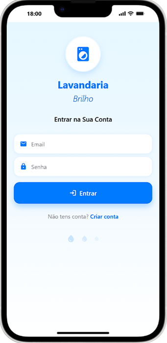
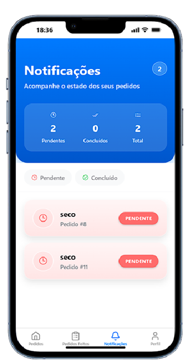
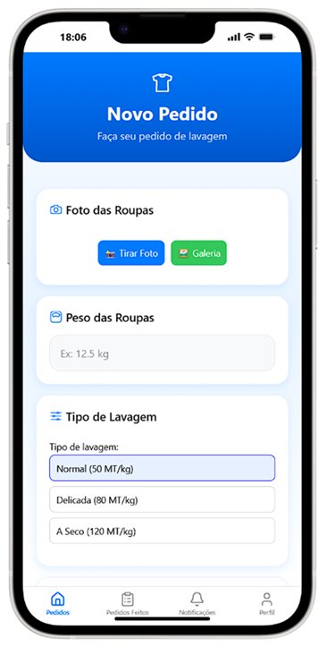
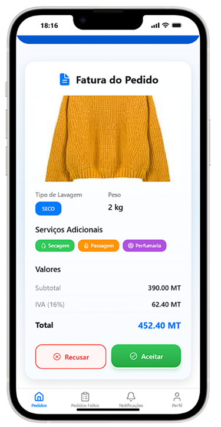
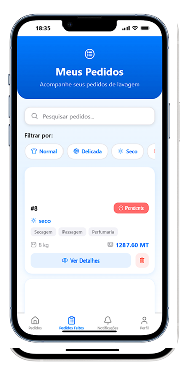
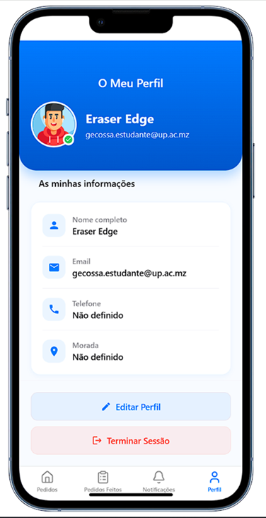
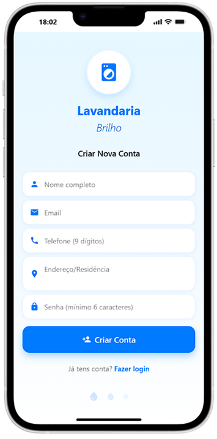

# 🔥 Root-GC — Sistema de Gestão de Pedidos  
Aplicação completa com backend em Laravel e frontend separado, criada para gerir pedidos, avaliar serviços, gerar faturas em PDF e acompanhar o estado de cada cliente. O foco do projeto é organização, automatização e facilidade de uso.

---

## 📌 Sumário
- [Descrição do Projeto](#descrição-do-projeto)
- [Arquitetura](#arquitetura)
- [Funcionalidades](#funcionalidades)
- [Tecnologias](#tecnologias)
- [Screenshots](#screenshots)
- [Instalação do Backend (Laravel)](#instalação-do-backend-laravel)
- [Instalação do Frontend](#instalação-do-frontend)
- [API Endpoints](#api-endpoints)
- [Documentação Extra](#documentação-extra)
- [Licença](#licença)

---

## 📘 Descrição do Projeto
O **Root-GC** é um sistema construído para gestão de pedidos, avaliação de serviços e geração de relatórios.  
Foi pensado para ambientes onde existe fluxo diário de clientes e onde é necessário acompanhar o estado e histórico de cada pedido.

O projeto incluiu:
- organização dos fluxos internos,
- documentação completa,
- geração de PDFs,
- dashboard com estatísticas dos últimos 7 dias,
- controlo de estados (pendente, em andamento, concluído).

---

## 🏗️ Arquitetura
O projeto está dividido em dois módulos principais:

Backend e frontend comunicam via HTTP utilizando endpoints REST.

---

## ⭐ Funcionalidades
- Registo e gestão de pedidos  
- Atualização do estado do pedido  
- Avaliação e emissão de faturas  
- Geração de PDF (usando DomPDF)  
- Dashboard com estatísticas  
- Contagem de pedidos dos últimos 7 dias  
- Rotas web com Blade  
- API pública para consumo por frontend externo

---

## 🛠️ Tecnologias

### **Backend**
- PHP 8+
- Laravel
- MySQL / MariaDB
- DomPDF
- Blade
- Spatie Permissions (se aplicável)

### **Frontend**
- HTML, CSS, JS ou framework que estiveres a usar  
- Fetch API para comunicação com Laravel

---

## 🖼️ Screenshots

📜 Licença

Este projeto está licenciado sob a Apache License.
Consulta o ficheiro LICENSE para mais detalhes.

🙌 Autor

Génio Nassone Cossa
Desenvolvedor  com foco em soluções limpas, práticas e eficientes.